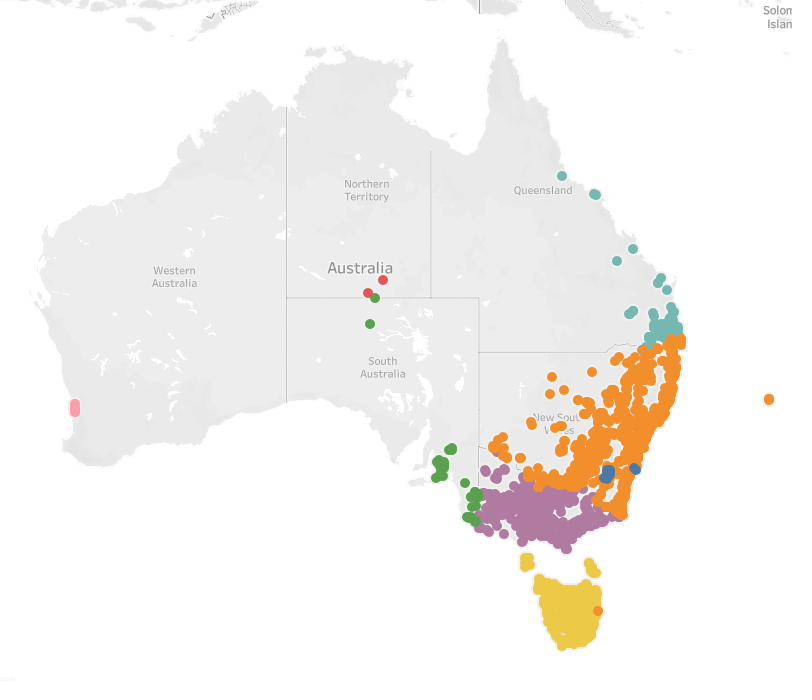
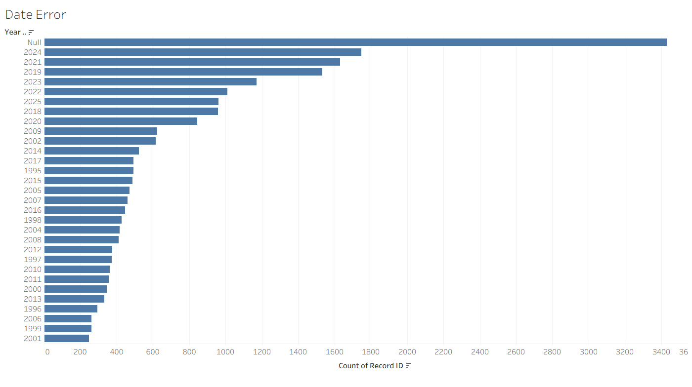
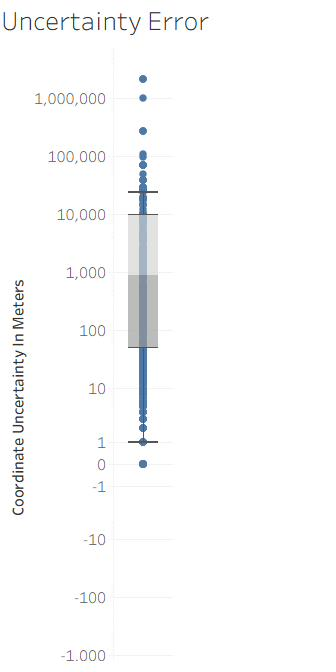
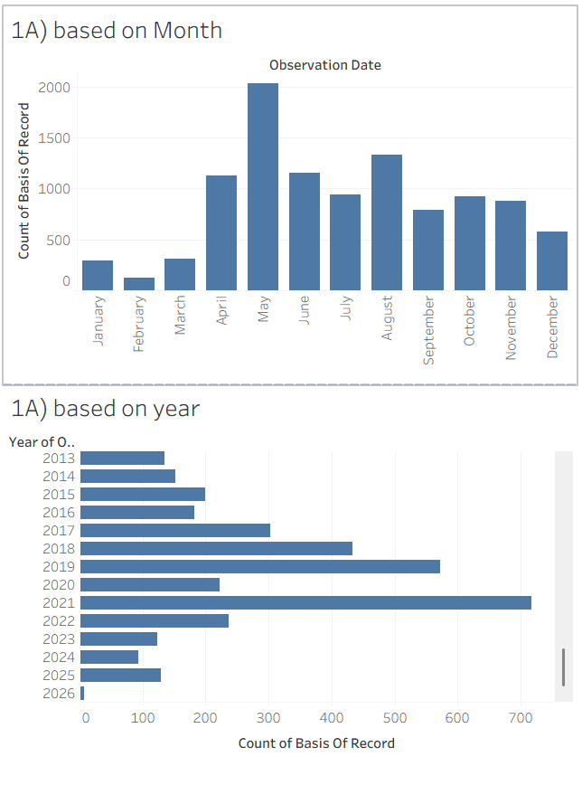
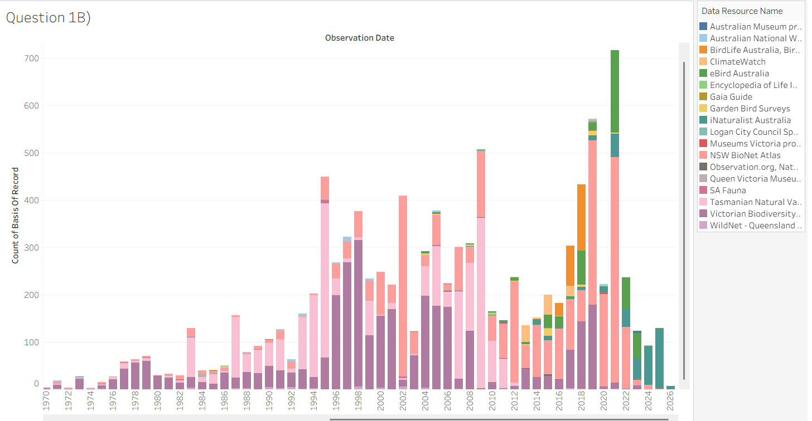
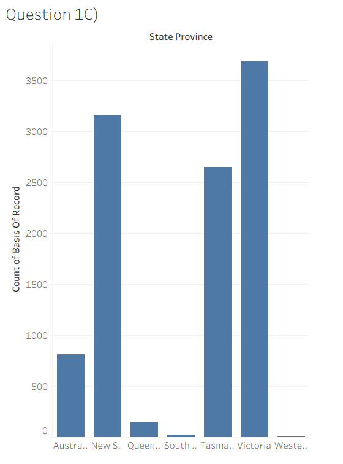

# 🦜 Swift Parrot Distribution Analysis

> Spatial and temporal analysis of the critically endangered **Swift Parrot** (*Lathamus discolor*) using occurrence data from the Atlas of Living Australia, combining **R** for reproducible data cleaning and **Tableau** for visual analytics.


<p align="center">
  
</p>

---

## 📑 Table of Contents

- [Overview](#-overview)
- [The Species](#-the-species)
- [Dataset](#-dataset)
- [Repository Structure](#-repository-structure)
- [Methodology](#-methodology)
- [Data Cleaning](#-data-cleaning)
- [Key Findings](#-key-findings)
- [How to Reproduce](#-how-to-reproduce)
- [Tech Stack](#-tech-stack)
- [Author](#-author)
- [License & Acknowledgements](#-license--acknowledgements)

---

## 🔍 Overview

The Swift Parrot is one of Australia's most endangered birds and one of only a
handful of migratory parrot species in the world. This project analyses its
observation records to uncover **where** and **when** the species is seen, and to
evaluate **how reliable** the underlying data sources are for tracking migration.

The workflow follows a two-tool pattern:

1. **Tableau** — used first to *visually detect* irregularities in the raw data
   (spatial outliers, inconsistent dates, extreme coordinate uncertainty).
2. **R (RStudio)** — used to *programmatically correct* those irregularities in a
   reproducible pipeline, then Tableau is used again for the final analytical
   visualisations.

The result is a data-driven narrative of the Swift Parrot's core habitats,
migratory timing, and the shift in biodiversity monitoring from state-run
databases toward citizen-science platforms.

---

## 🐦 The Species

| | |
|---|---|
| **Common name** | Swift Parrot |
| **Scientific name** | *Lathamus discolor* |
| **Conservation status** | Critically Endangered |
| **Breeding range** | Tasmania (only breeding ground) |
| **Wintering range** | South-eastern mainland Australia (Victoria, NSW) |
| **Behaviour** | Migratory — crosses Bass Strait seasonally |

---

## 📊 Dataset

Source: **[Atlas of Living Australia (ALA)](https://www.ala.org.au/)** — occurrence records for *Lathamus discolor*.

| | Raw | Cleaned |
|---|---:|---:|
| **Records** | 25,276 | 10,483 |
| **Removed** | — | 14,793 (58.5%) |

**Columns:** `dataResourceUid`, `dataResourceName`, `basisOfRecord`,
`observationDate`, `stateProvince`, `decimalLatitude`, `decimalLongitude`,
`coordinateUncertaintyInMeters`, `scientificName`, `vernacularName`, `recordID`.

> ⚠️ The high removal rate reflects the strict quality thresholds applied
> (invalid/future dates and >10 km positional uncertainty), prioritising
> analytical accuracy over record volume.

---

## 🗂 Repository Structure

```
swift-parrot-distribution-analysis/
├── README.md
├── LICENSE
├── .gitignore
├── data/
│   ├── raw/
│   │   └── ALA_S12026PE1.csv                  # original ALA export (25,276 rows)
│   └── processed/
│       └── Final_Cleaned_Swift_Parrot_Data.csv # cleaned output (10,483 rows)
├── R/
│   ├── Data_Cleaning.Rmd                       # reproducible cleaning pipeline
│   └── Data_wrangling.Rproj                    # RStudio project file
├── tableau/
│   └── report.twb                              # Tableau workbook (dashboards)
├── figures/
│   ├── data-quality/                           # irregularities detected in Tableau
│   │   ├── Location_Error.png
│   │   ├── Date_Error.png
│   │   └── Uncertainty_Error.png
│   └── analysis/                               # final analytical charts
│       ├── Q1-A.png
│       ├── Q1B.png
│       └── Q1C.png
└── report/
    └── Swift_Parrot_Analysis_Report.pdf        # full written report
```

---

## 🧭 Methodology

The analysis is organised around four research questions:

| # | Question | Visualisation |
|---|----------|---------------|
| **1A** | How do sightings change across **months and years**? | Line chart + bar chart |
| **1B** | How have **data resources** contributed over time? | Stacked chart |
| **1C** | **Where** (which states) are Swift Parrots observed? | Bar chart |
| **2**  | Which data resource best represents **seasonal migration**? | Reflection |

---

## 🧹 Data Cleaning

Three irregularities were detected in Tableau and resolved in R
(`R/Data_Cleaning.Rmd`):

### 1. Geographic outliers (points in the ocean)
Latitude/longitude were swapped in some records, placing birds in Western
Australia and the Indian Ocean — impossible for an endemic south-eastern species.
Coordinates were swapped back into the correct axes.

<p align="center"></p>

### 2. Temporal anomalies (date errors)
`observationDate` mixed multiple formats and contained invalid/future values.
The **`lubridate`** package standardised the field; unparseable and future dates
were removed.

<p align="center"></p>

### 3. High coordinate uncertainty
A box plot revealed records with positional uncertainty up to 100 km. Records
above a **10 km** threshold were filtered out to keep habitat mapping reliable.

<p align="center"></p>

---

## 📈 Key Findings

### 1A — Temporal Trends
Sightings **peak from April to August (highest in May)** and drop between October
and January. This matches the species' biology: the winter peak coincides with
migration to the mainland to forage, while the summer decline reflects the return
to Tasmania to breed. Yearly records rise sharply after 2010 — driven largely by
digital reporting, not population growth.

<p align="center"></p>

### 1B — Evolution of Data Resources
State-based databases (**Victorian Biodiversity Atlas**, **NSW BioNet**) dominated
early decades, but records from **eBird Australia** surged from ~2010 onward —
marking a clear shift from agency-led surveys to **citizen science**.

<p align="center"></p>

### 1C — Spatial Distribution
Observations concentrate in **Victoria, New South Wales and Tasmania**, aligning
with the species' known breeding (Tasmania) and wintering (mainland) grounds.

<p align="center"></p>

| State | Records (cleaned) |
|-------|------------------:|
| Victoria | 3,686 |
| New South Wales | 3,156 |
| Tasmania | 2,648 |
| Australian Capital Territory | 815 |
| Queensland | 147 |
| South Australia | 25 |
| Western Australia | 6 |

### 2 — Best Resource for Migration Tracking
**eBird Australia** emerges as the most effective resource for monitoring active
migration: its high volume, real-time nature and strong alignment with the
April–August peak give a higher-resolution view of movement than static, historical
databases — though traditional atlases remain vital for long-term context.

---

## ▶️ How to Reproduce

### Prerequisites
- [R](https://www.r-project.org/) (≥ 4.0) and [RStudio](https://posit.co/download/rstudio-desktop/)
- [Tableau Desktop / Public](https://www.tableau.com/) to open `tableau/report.twb`

### Run the cleaning pipeline
```r
# From the repository root, open R/Data_wrangling.Rproj in RStudio, then:
install.packages(c("dplyr", "lubridate"))

# Knit the notebook, or run it chunk by chunk:
rmarkdown::render("R/Data_Cleaning.Rmd")
```
The script reads `data/raw/ALA_S12026PE1.csv` and writes
`data/processed/Final_Cleaned_Swift_Parrot_Data.csv` using **relative paths**, so
no configuration is required.

### Explore the visualisations
Open `tableau/report.twb` in Tableau and connect it to the cleaned CSV in
`data/processed/`.

---

## 🛠 Tech Stack

- **R** — `dplyr`, `lubridate` (data wrangling & date parsing)
- **Tableau** — exploratory data quality checks & final dashboards
- **Atlas of Living Australia** — data source

---

## 👤 Author

**Farzan Momayezi**
Data Visualisation coursework project.

---

## 📄 License & Acknowledgements

- Code and documentation released under the [MIT License](LICENSE).
- Occurrence data © the [Atlas of Living Australia](https://www.ala.org.au/) and
  its contributing data providers, used here for educational purposes. Please
  respect the ALA's [terms of use](https://www.ala.org.au/terms-of-use/) and cite
  the original data resources when reusing.
